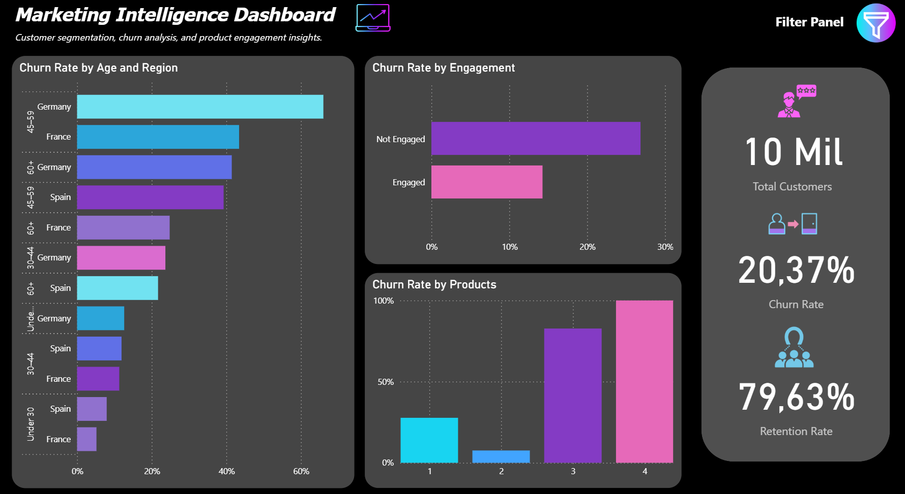

# 📊 Marketing Intelligence Dashboard — Power BI

> **Customer segmentation, churn analysis, and product engagement insights.**

[](Captura de tela 2026-05-07 182515.png)


---

## 🔗 Live Dashboard

👉 [**View the Dashboard on Power BI**](https://app.powerbi.com/groups/me/reports/a91e0be4-bb72-4eb5-81a9-5bdb49389888/ae156cf60a38cc2b7dd2?experience=power-bi&bookmarkGuid=8ba32d470be98014ee16)

---

## 📌 Project Overview

This dashboard was built in **Power BI Desktop** to help marketing and business teams understand customer behavior, identify churn patterns, and monitor retention performance. It combines visual storytelling with interactive filters to allow stakeholders to drill down by geography, demographics, engagement level, and product usage.

---

## 🗂️ Dataset

**Source file:** `Churn_Modelling.csv`

The dataset contains **10,000 bank customers** with the following fields:

| Column | Description |
|---|---|
| `RowNumber` | Row index |
| `CustomerId` | Unique customer identifier |
| `Surname` | Customer last name |
| `CreditScore` | Customer credit score |
| `Geography` | Country: France, Germany, or Spain |
| `Gender` | Male or Female |
| `Age` | Customer age |
| `Tenure` | Number of years as a customer |
| `Balance` | Account balance |
| `NumOfProducts` | Number of bank products used (1–4) |
| `HasCrCard` | Whether the customer has a credit card (1 = Yes, 0 = No) |
| `IsActiveMember` | Whether the customer is an active member (1 = Yes, 0 = No) |
| `EstimatedSalary` | Estimated annual salary |
| `Exited` | **Target variable** — whether the customer churned (1 = Yes, 0 = No) |

---

## 🔧 Data Transformation (Power Query)

Before building the visuals, several transformations were applied inside **Power Query Editor** to make the data more meaningful and readable:

### Age Group (Conditional Column)
The numeric `Age` column was bucketed into four descriptive age ranges:

```
Age < 30              → "Under 30"
Age >= 30 AND < 45    → "30–44"
Age >= 45 AND < 60    → "45–59"
Age >= 60             → "60+"
```

### Engagement Status (Conditional Column)
The binary `IsActiveMember` field was replaced with a human-readable label:

```
IsActiveMember = 1  → "Engaged"
IsActiveMember = 0  → "Not Engaged"
```

### Customer Tenure Category (Conditional Column)
The `Tenure` column (years as a customer) was segmented into lifecycle stages:

```
Tenure <= 2   → "New"
Tenure <= 6   → "Growing"
Tenure > 6    → "Loyal"
```

### Churn Label
The `Exited` column (0/1) was used directly in DAX measures to calculate churn and retention rates.

---

## 📐 DAX Measures

The following measures were created to power the KPI cards and visual calculations:

```dax
-- Total number of customers
Total Customers = COUNTROWS('Churn_Modelling')

-- Total number of churned customers
Churned Customers = CALCULATE(COUNTROWS('Churn_Modelling'), 'Churn_Modelling'[Exited] = 1)

-- Churn Rate as a percentage
Churn Rate = DIVIDE([Churned Customers], [Total Customers], 0)

-- Retention Rate
Retention Rate = 1 - [Churn Rate]
```

These measures respond dynamically to all slicers in the Filter Panel.

---

## 📊 Visuals & Design Choices

### 1. Churn Rate by Age and Region *(Horizontal Bar Chart)*
Displays the churn rate broken down by **age group** and **country (Geography)**. Each bar represents a combination of age range and region, allowing comparison across demographics and geographies simultaneously. Countries are color-coded (Germany in cyan, France in purple/pink, Spain in violet).

### 2. Churn Rate by Engagement *(Bar Chart)*
Compares the churn rate between **Engaged** and **Not Engaged** customers. This visual highlights the impact of member activity on churn behavior — customers who are not engaged consistently show a higher churn rate.

### 3. Churn Rate by Products *(Bar Chart)*
Shows the churn rate segmented by **number of products** the customer holds (1 to 4). A notable insight from the data: customers with 3 or 4 products have significantly higher churn rates, suggesting possible over-selling or product dissatisfaction.

### 4. KPI Cards *(Card Visuals)*

| KPI | Value |
|---|---|
| 👤 Total Customers | 10,000 |
| 📉 Churn Rate | 20.37% |
| 🤝 Retention Rate | 79.63% |

---

## 🎛️ Interactive Filter Panel

A custom **Filter Panel** (slide-in panel using a bookmark + button) lets users filter all visuals simultaneously by:

- **Gender:** Female / Male
- **Engagement:** Engaged / Not Engaged
- **Region:** France / Germany / Spain
- **Customer Tenure:** New / Growing / Loyal

The panel is toggled via a filter icon button in the top-right corner. An **"X"** button closes it and a **clear filters** button (eraser icon) resets all selections.

---

## 🎨 Design & Theme

| Element | Choice |
|---|---|
| Background | Dark (#1C1C1E) |
| Primary accent | Cyan / Electric Blue |
| Secondary accent | Violet / Purple |
| Tertiary accent | Hot Pink / Magenta |
| Font | Segoe UI (Power BI default) |
| Layout | Dark theme for high contrast and a modern analytics feel |

The color palette was intentionally kept to a three-color spectrum (cyan → purple → pink) to create visual cohesion across all charts.

---

## 📁 Project Structure

```
📦 marketing-intelligence-dashboard
 ┣ 📊 Marketing - Dashboard.pbix   # Power BI project file
 ┣ 📄 Churn_Modelling.csv          # Source dataset
 ┗ 📖 README.md                    # This file
```

---

## 🚀 How to Run Locally

1. Download and install [Power BI Desktop](https://powerbi.microsoft.com/desktop/) (free).
2. Clone this repository:
   ```bash
   git clone https://github.com/CamillySR/marketing-intelligence-dashboard.git
   ```
3. Open `Marketing - Dashboard.pbix` in Power BI Desktop.
4. If prompted, point the data source to the `Churn_Modelling.csv` file in the same folder.
5. Click **Refresh** to load the data.

---

## 🙋 Author

Made with 💜 using Power BI.  
Feel free to connect or reach out if you have questions about the project!
